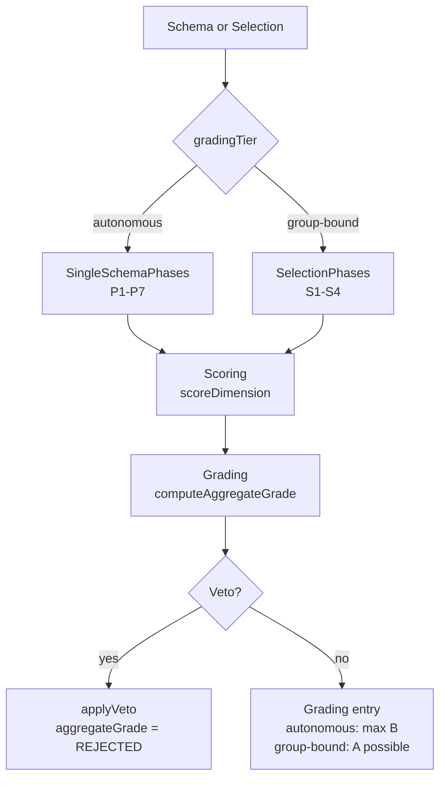

[]() 

# flowmcp-grading

Reference implementation of the FlowMCP Grading-Spec (`gradingSpec/1.0.0`) — a normative, RFC 2119-aligned specification for evaluating the quality of FlowMCP schemas and selections. The repository hosts the spec documents (`spec/1.0.0/`), the source modules that implement Scoring, Grading, and Veto logic, LLM grader prompts, and the unit test suite. The spec is a **living document** and evolves with the FlowMCP schema corpus.

## NICHT-PUSH-Konvention für `grading-data/`

> **WARNING — DO NOT PUSH `grading-data/`.**
>
> The folder `grading-data/` contains all grading run results (`grading-data/<schemaId>/<timestamp>.json`). It is **explicitly listed in `.gitignore`** and **MUST NEVER be pushed** to the remote. This convention keeps grading results inside the repo (so AI tools can find them via a predictable relative path) while preventing accidental leakage of data and intermediate states to the public.
>
> Documented in three places: this README, `AGENTS.md`, and the commented entry in `.gitignore`. If you add new tooling that writes grading results, write them only to `grading-data/` — never anywhere else.

The red line that prevents writing data under `~/.flowmcp/` is documented in `AGENTS.md`. AI tools have caused damage in the user-home in the past; this repo provides the **correct** location instead.

## Architecture

Two skill families per Memo 076 F13 — one shared data model, two evaluation paths with different tier ceilings.



## Quickstart

Clone the repository and install dependencies:

```bash
git clone https://github.com/FlowMCP/flowmcp-grading.git
cd flowmcp-grading
npm install
```

```javascript
import { gradeSingleSchema } from './src/index.mjs'

const { grading, errors } = gradeSingleSchema( {
    schemaPath: './path/to/schema.mjs',
    schemaId: 'provider.schemaName',
    grader: { kind: 'human', name: 'andreas', version: '1' }
} )

console.log( grading.aggregateGrade )
```

Results are written to `grading-data/<schemaId>/<timestamp>.json` — never pushed.

## Features

- **Two-tier model (F13)** — Single-Schema (autonomous, max grade B) vs. Selection (group-bound, grade A possible)
- **Versioned namespaces** — `gradingSpec/1.0.0`, `scoringSystem/1.0.0`, `gradingSystem/1.0.0` evolve independently
- **Categorical-Veto** — closed list of four triggers (`malicious-module`, `api-key-domain-mismatch`, `illegal-content`, `ai-security-veto`) halts the pipeline
- **Aging-aware** — defaults at 14/30/180 days, gradings turn `stale` (never `fail`) when aged
- **`n/a`-Pragma** — dimensions that cannot be evaluated are ignored in the weighted sum (Memo 054)
- **Structured error codes** — `GRD-`, `SCO-`, `VET-` prefixes per `node-error-codes` pattern
- **Pilot gradings included** — three reference gradings (Brightsky, Etherscan, Abgeordnetenwatch) under `grading-data/`

## Table of Contents

- [flowmcp-grading](#flowmcp-grading)
  - [NICHT-PUSH-Konvention für grading-data/](#nicht-push-konvention-für-grading-data)
  - [Architecture](#architecture)
  - [Quickstart](#quickstart)
  - [Features](#features)
  - [Methods](#methods)
    - [.gradeSingleSchema()](#gradesingleschema)
    - [.gradeSelection()](#gradeselection)
    - [.validateGradingEntry()](#validategradingentry)
    - [.getVersion()](#getversion)
    - [Class Exports](#class-exports)
  - [Repository Layout](#repository-layout)
  - [Versioning](#versioning)
  - [Hierarchy](#hierarchy)
  - [Contributing](#contributing)
  - [License](#license)

## Methods

The public API consists of four convenience functions for common grading flows, plus six classes for direct access to the underlying primitives. All methods are static with object parameters and object returns.

### `.gradeSingleSchema()`

Runs the autonomous Single-Schema pipeline (P1-P7) for one schema. Returns a grading entry with `aggregateGrade` and `maxAttainableGrade` (capped at `B` per F13).

**Method**

```
.gradeSingleSchema( { schemaPath, schemaId, grader, options } )
```

| Key | Type | Description | Required |
|-----|------|-------------|----------|
| schemaPath | string | Filesystem path to the schema `.mjs` file | Yes |
| schemaId | string | Stable identifier for the schema (e.g. `provider.schemaName`) | Yes |
| grader | object | Grader identity (`{ kind, name, version, ... }`) | Yes |
| options | object | Optional flags forwarded to phase runners | No |

**Example**

```javascript
const { grading, errors } = gradeSingleSchema( {
    schemaPath: './schemas/brightsky/bright-sky.mjs',
    schemaId: 'brightsky.bright-sky',
    grader: { kind: 'human', name: 'andreas', version: '1' }
} )
```

**Returns**

```
returns { grading, errors }
```

| Key | Type | Description |
|-----|------|-------------|
| grading | object \| null | Grading entry with `aggregateGrade`, `maxAttainableGrade`, `gradings[]` |
| errors | array of strings | Error codes (`GRD-001`, `GRD-002`, `GRD-003`) if validation failed |

### `.gradeSelection()`

Runs the group-bound Selection pipeline (S1-S4) for a set of schemas evaluated as a coherent group. Grade `A` is possible (unlike `gradeSingleSchema`).

**Method**

```
.gradeSelection( { selectionId, schemaIds, grader, options } )
```

| Key | Type | Description | Required |
|-----|------|-------------|----------|
| selectionId | string | Identifier of the selection group | Yes |
| schemaIds | array of strings | Schema ids contained in the selection | Yes |
| grader | object | Grader identity (`{ kind, name, version, ... }`) | Yes |
| options | object | Optional flags forwarded to phase runners | No |

**Example**

```javascript
const { grading, errors } = gradeSelection( {
    selectionId: 'crypto-onchain',
    schemaIds: [ 'etherscan.getContractEthereum', 'moralis.getNftPrices' ],
    grader: { kind: 'human', name: 'andreas', version: '1' }
} )
```

**Returns**

```
returns { grading, errors }
```

| Key | Type | Description |
|-----|------|-------------|
| grading | object \| null | Grading entry with `selectionId`, `schemaIds`, `aggregateGrade`, `maxAttainableGrade` |
| errors | array of strings | Error codes (`GRD-001`, `GRD-002`, `GRD-004`) if validation failed |

### `.validateGradingEntry()`

Structural validation of a grading entry against the data model defined in `spec/1.0.0/08-grading-model.md`. Use to verify externally generated grading JSON before downstream consumption.

**Method**

```
.validateGradingEntry( { entry } )
```

| Key | Type | Description | Required |
|-----|------|-------------|----------|
| entry | object | The grading entry to validate (must contain `schemaId`, `gradings[]`, `gradingTier`) | Yes |

**Example**

```javascript
const { valid, errors } = validateGradingEntry( { entry: someGradingObject } )
if( !valid ) { console.error( errors ) }
```

**Returns**

```
returns { valid, errors }
```

| Key | Type | Description |
|-----|------|-------------|
| valid | boolean | `true` if the entry conforms to the model |
| errors | array of strings | Error codes (`GRD-001`, `GRD-002`, `GRD-003`) if invalid |

### `.getVersion()`

Returns the version triple for the three independent namespaces.

**Method**

```
.getVersion()
```

No input parameters.

**Example**

```javascript
const { scoringSystem, gradingSystem, repoVersion } = getVersion()
```

**Returns**

```
returns { scoringSystem, gradingSystem, repoVersion }
```

| Key | Type | Description |
|-----|------|-------------|
| scoringSystem | string | Current `scoringSystem` version (e.g. `1.0.0`) |
| gradingSystem | string | Current `gradingSystem` version (e.g. `1.0.0`) |
| repoVersion | string | Repository version from `package.json` |

### Class Exports

Six classes expose the underlying primitives for advanced use. All methods are static with object parameters.

| Class | Purpose | Key Static Methods | Error Prefix |
|-------|---------|--------------------|--------------|
| `Grading` | Grading entry lifecycle, aggregation, aging, re-grading | `createEntry`, `addGrading`, `computeAggregateGrade`, `applyRegradingTrigger`, `checkAging` | `GRD-` |
| `Scoring` | Per-dimension scoring + weighted sum aggregation | `scoreDimension`, `validateScore`, `computeWeightedSum` | `SCO-` |
| `Veto` | Categorical veto application (closed 4-trigger list) | `getTriggers`, `applyVeto`, `isVetoed`, `validateVeto` | `VET-` |
| `SingleSchemaPhases` | Autonomous P1-P7 phase runners | `runP1` .. `runP7`, `runAll`, `getTier` | `GRD-` |
| `SelectionPhases` | Group-bound S1-S4 phase runners | `runS1` .. `runS4`, `runAll`, `getTier` | `GRD-` |
| `ErrorCodes` | Error code lookup, formatting, listing | `getCode`, `formatMessage`, `listByPrefix`, `listBySeverity`, `validateCodeFormat` | `GRD-`, `SCO-`, `VET-` |

See `spec/1.0.0/08-grading-model.md` for the full data model and `src/` for in-source JSDoc.

## Repository Layout

```
flowmcp-grading/
├── README.md                 # This file (prominent NICHT-PUSH note for grading-data/)
├── AGENTS.md                 # Convention for AI tools (red line "no data under ~/.flowmcp/")
├── .gitignore                # With commented grading-data/ entry
├── package.json              # ES Modules, Node 22
├── src/
│   ├── index.mjs             # Public API entry point
│   ├── Scoring.mjs           # Scoring System
│   ├── Grading.mjs           # Grading System
│   ├── Veto.mjs              # Categorical-Veto logic
│   ├── ErrorCodes.mjs        # GRD-/SCO-/VET- code tables
│   └── Phases/
│       ├── SingleSchema.mjs  # P1-P7 (Skill-Family 1, autonomous)
│       └── Selection.mjs     # S1-S4 (Skill-Family 2, group-bound)
├── spec/
│   └── 1.0.0/                # Grading-Spec chapters 00-overview .. 14-kanban + JSON-Schemas
├── prompts/                  # Versioned LLM grader prompts
├── tests/
│   ├── unit/                 # Jest unit tests
│   ├── integration/
│   └── helpers/              # Shared fixtures
└── grading-data/             # .gitignored — grading results live here
    └── .keep                 # Keeps folder in repo
```

## Versioning

Three independent namespaces (Memo 076 F5):

- `gradingSpec/1.0.0` — the specification documents under `spec/1.0.0/`
- `scoringSystem/1.0.0` — the scoring rules and dimensions
- `gradingSystem/1.0.0` — the grading rules, veto logic, and tier mapping

These versions are **never coupled**. Bumping one does not imply bumping the others.

## Hierarchy

The [FlowMCP Schemas Specification](https://github.com/FlowMCP/flowmcp-spec) at `spec/v4.1.0/` is the highest instance — it defines what a schema, a selection, and the primitives are. This Grading-Spec sits below and describes **how** schemas and selections are evaluated. See `spec/1.0.0/00-overview.md` for the full hierarchy table.

## Contributing

Contributions are welcome! Please open an issue first to discuss what you would like to change.

## License

[MIT](LICENSE)
