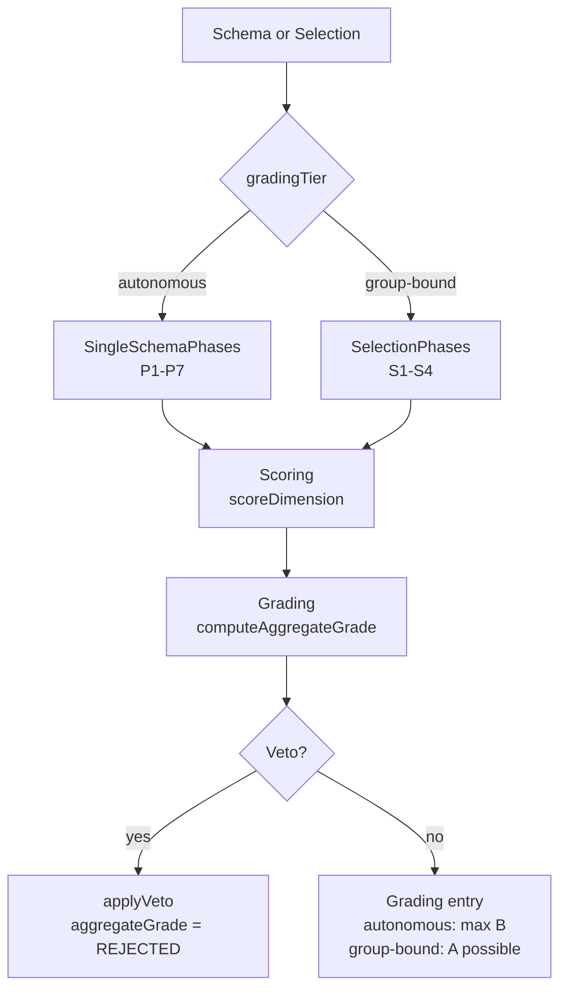

[]() 

# flowmcp-grading

Reference implementation of the FlowMCP Grading-Spec. The active spec is `gradingSpec/1.1.0`
(extended with the Source-of-Truth layout and the Pre-Condition rule).
The repository hosts the spec documents (`flowmcp-spec/grading/1.1.0/`), the source modules that implement Scoring,
Grading, and Veto logic, LLM grader prompts, and the unit test suite. The spec is a **living
document** and evolves with the FlowMCP schema corpus.

## Documentation

This repo documents two structurally different test artifacts:

- **[Code Test Catalog](./docs/test-catalog.md)** — Jest tests that protect the engine
  itself. Runs via `npm test`. Static, manually curated index.
- **[Eval Question Catalog](./docs/question-catalog.md)** — questions that an
  LLM sub-agent answers during a grading. Auto-generated from
  `prompts/generated/questions.json` via `npm run build:question-catalog-doc`.

Both artifacts are complementary: code tests check the engine, eval questions
check the schemas. They are frequently confused — the two catalogs make
the difference explicit.

## Starting a Grading

A grading is run in an empty LLM context. The empty-context requirement
is conventional (see [Spec §3](https://github.com/FlowMCP/flowmcp-spec/blob/main/grading/1.1.0/02-eligibility.md) + [Spec §18](https://github.com/FlowMCP/flowmcp-spec/blob/main/grading/1.1.0/20-entry-point-prompt.md))
and is ensured by the following entry-point prompt.

### Entry-Point Prompt (binding)

```text
You are performing a FlowMCP grading. Instructions:

1. Persona: crypto-trader-2026
2. Selection: crypto-domain-full, lockfile hash: <sha>
3. Mode: Full (initial baseline)
4. Spec version: gradingSpec/1.1.0
5. Pre-Condition: all member schemas have gradingStatus: stable
6. Output format: gradings/<selection-hash>--<timestamp>.json
```

This prompt block must be adopted **verbatim**. Only the following are adjustable:

- `Persona` — one of the personas registered in the repo (mandatory, see below)
- `Selection` — `<selectionId>`, plus `lockfile hash` from the current `selection.lock.json`
- `Mode` — `Full` (initial / stable promotion) or `Partial` (iteration step)
- `Spec version` — currently `gradingSpec/1.1.0`

For **single gradings**, replace line 2 with:

```text
2. Schema: <namespace>.<tool>, schema hash: <sha>, schemaVersion: <X.Y.Z>
```

And line 5 is dropped (single schemas have no member pre-condition).

### Persona Requirement

In the entry-point prompt, **persona is mandatory** — for single and selection alike.
A grading without a persona entry is rejected by the schema validator.

Registered personas live under `grading-data/personas/<persona-id>.md`.

## Quick-Start

For a clean grading run:

1. Run `/clear` in the LLM client (establish an empty context)
2. Copy the entry-point prompt from the section above **in full**
3. Fill in the fields in the copied prompt:
   - **Persona** (mandatory) — from `grading-data/personas/`
   - **Selection** + **lockfile hash** — from `selection/<id>/selection.lock.json`
   - **Mode** — `Full` (default) or `Partial`
4. Send the prompt — the agent runs the grading sequence
5. The result lands under `grading-data/{single,selection}/.../gradings/<hash>--<timestamp>.json`

See [Spec §18](https://github.com/FlowMCP/flowmcp-spec/blob/main/grading/1.1.0/20-entry-point-prompt.md) (entry-point prompt) and [Spec §20](https://github.com/FlowMCP/flowmcp-spec/blob/main/grading/1.1.0/21-pre-conditions.md) (pre-conditions) for the formal definition. The empty-context convention is anchored in [Spec §3](https://github.com/FlowMCP/flowmcp-spec/blob/main/grading/1.1.0/02-eligibility.md).

## Status — Phase 2 complete

Three pilot gradings have been migrated to the new Source-of-Truth layout:

- `brightsky.bright-sky`
- `etherscan.getContractEthereum`
- `abgeordnetenwatch.abgeordnetenwatch`

Each pilot now has:

- A frozen schema snapshot under `grading-data/schemas/<namespace>/PLACEHOLDER###--v1.0.0.mjs`
  (placeholder hashes will be replaced by deterministic sha256 values in a later phase).
- A namespace payload at `grading-data/schemas/<namespace>/namespace.json` with `namespaceHash`
  and `aboutHash: "PENDING"` (about pages arrive in a later phase).
- A grading entry under `grading-data/single/<namespace>--<tool>/gradings/<schemaHash>--<timestamp>.json`.
- A phase-status file at `grading-data/phase-status/single/<namespace>--<tool>.json`.

Migration scripts that produced this state:

- `scripts/migrate-080-phase-2.mjs` — Pilot → SoT layout, schema snapshotting, skeleton creation.
- `scripts/generate-namespace-json.mjs` — auto-generates `namespace.json` per namespace.
- `scripts/separate-phase-status.mjs` — splits `phase-status/` into `single/` and `selection/`.

All scripts are idempotent and support `--dry-run`.

## Do-Not-Push Convention for `grading-data/`

> **WARNING — DO NOT PUSH `grading-data/`.**
>
> The folder `grading-data/` contains all grading-run results, schema snapshots, namespace
> payloads, phase-status, and the `.migration-backup/` archive. It is **explicitly listed in
> `.gitignore`** and **MUST NEVER be pushed** to the remote. This convention keeps grading
> results inside the repo (so AI tools can find them via a predictable relative path) while
> preventing accidental leakage of data and intermediate states to the public.
>
> Documented in three places: this README, `AGENTS.md`, and the commented entry in `.gitignore`. If you add new tooling that writes grading results, write them only to `grading-data/` — never anywhere else.

The red line that prevents writing data under `~/.flowmcp/` is documented in `AGENTS.md`. AI tools have caused damage in the user-home in the past; this repo provides the **correct** location instead.

## Architecture

Two skill families (F13) — one shared data model, two evaluation paths with different tier ceilings.



## Quickstart

Clone the repository and install dependencies:

```bash
git clone https://github.com/FlowMCP/flowmcp-grading.git
cd flowmcp-grading
npm install
```

```javascript
import { gradeSingleSchema } from './src/index.mjs'

const { grading, errors } = gradeSingleSchema( {
    schemaPath: './path/to/schema.mjs',
    schemaId: 'provider.schemaName',
    grader: { kind: 'human', name: 'andreas', version: '1' }
} )

console.log( grading.aggregateGrade )
```

Results are written to `grading-data/single/<namespace>--<tool>/gradings/<schemaHash>--<timestamp>.json` (Source-of-Truth layout) — never pushed.

## Features

- **Two-tier model (F13)** — Single-Schema (autonomous, max grade B) vs. Selection (group-bound, grade A possible)
- **Versioned namespaces** — `gradingSpec/1.1.0`, `scoringSystem/1.0.0`, `gradingSystem/1.0.0` evolve independently
- **Categorical-Veto** — closed list of four triggers (`malicious-module`, `api-key-domain-mismatch`, `illegal-content`, `ai-security-veto`) halts the pipeline
- **Aging-aware** — defaults at 14/30/180 days, gradings turn `stale` (never `fail`) when aged
- **`n/a`-Pragma** — dimensions that cannot be evaluated are ignored in the weighted sum
- **Structured error codes** — `GRD-`, `SCO-`, `VET-` prefixes per `node-error-codes` pattern
- **Pilot gradings included** — three reference gradings (Brightsky, Etherscan, Abgeordnetenwatch) under `grading-data/`

## Table of Contents

- [flowmcp-grading](#flowmcp-grading)
  - [Do-Not-Push Convention for grading-data/](#do-not-push-convention-for-grading-data)
  - [Architecture](#architecture)
  - [Quickstart](#quickstart)
  - [Features](#features)
  - [Methods](#methods)
    - [.gradeSingleSchema()](#gradesingleschema)
    - [.gradeSelection()](#gradeselection)
    - [.validateGradingEntry()](#validategradingentry)
    - [.getVersion()](#getversion)
    - [Class Exports](#class-exports)
  - [Repository Layout](#repository-layout)
  - [Versioning](#versioning)
  - [Hierarchy](#hierarchy)
  - [Contributing](#contributing)
  - [License](#license)

## Methods

The public API consists of four convenience functions for common grading flows, plus six classes for direct access to the underlying primitives. All methods are static with object parameters and object returns.

### `.gradeSingleSchema()`

Runs the autonomous Single-Schema pipeline (P1-P7) for one schema. Returns a grading entry with `aggregateGrade` and `maxAttainableGrade` (capped at `B` per F13).

**Method**

```
.gradeSingleSchema( { schemaPath, schemaId, grader, options } )
```

| Key | Type | Description | Required |
|-----|------|-------------|----------|
| schemaPath | string | Filesystem path to the schema `.mjs` file | Yes |
| schemaId | string | Stable identifier for the schema (e.g. `provider.schemaName`) | Yes |
| grader | object | Grader identity (`{ kind, name, version, ... }`) | Yes |
| options | object | Optional flags forwarded to phase runners | No |

**Example**

```javascript
const { grading, errors } = gradeSingleSchema( {
    schemaPath: './schemas/brightsky/bright-sky.mjs',
    schemaId: 'brightsky.bright-sky',
    grader: { kind: 'human', name: 'andreas', version: '1' }
} )
```

**Returns**

```
returns { grading, errors }
```

| Key | Type | Description |
|-----|------|-------------|
| grading | object \| null | Grading entry with `aggregateGrade`, `maxAttainableGrade`, `gradings[]` |
| errors | array of strings | Error codes (`GRD-001`, `GRD-002`, `GRD-003`) if validation failed |

### `.gradeSelection()`

Runs the group-bound Selection pipeline (S1-S4) for a set of schemas evaluated as a coherent group. Grade `A` is possible (unlike `gradeSingleSchema`).

**Method**

```
.gradeSelection( { selectionId, schemaIds, grader, options } )
```

| Key | Type | Description | Required |
|-----|------|-------------|----------|
| selectionId | string | Identifier of the selection group | Yes |
| schemaIds | array of strings | Schema ids contained in the selection | Yes |
| grader | object | Grader identity (`{ kind, name, version, ... }`) | Yes |
| options | object | Optional flags forwarded to phase runners | No |

**Example**

```javascript
const { grading, errors } = gradeSelection( {
    selectionId: 'crypto-onchain',
    schemaIds: [ 'etherscan.getContractEthereum', 'moralis.getNftPrices' ],
    grader: { kind: 'human', name: 'andreas', version: '1' }
} )
```

**Returns**

```
returns { grading, errors }
```

| Key | Type | Description |
|-----|------|-------------|
| grading | object \| null | Grading entry with `selectionId`, `schemaIds`, `aggregateGrade`, `maxAttainableGrade` |
| errors | array of strings | Error codes (`GRD-001`, `GRD-002`, `GRD-004`) if validation failed |

### `.validateGradingEntry()`

Structural validation of a grading entry against the data model defined in `flowmcp-spec/grading/1.1.0/08-grading-model.md`. Use to verify externally generated grading JSON before downstream consumption.

**Method**

```
.validateGradingEntry( { entry } )
```

| Key | Type | Description | Required |
|-----|------|-------------|----------|
| entry | object | The grading entry to validate (must contain `schemaId`, `gradings[]`, `gradingTier`) | Yes |

**Example**

```javascript
const { valid, errors } = validateGradingEntry( { entry: someGradingObject } )
if( !valid ) { console.error( errors ) }
```

**Returns**

```
returns { valid, errors }
```

| Key | Type | Description |
|-----|------|-------------|
| valid | boolean | `true` if the entry conforms to the model |
| errors | array of strings | Error codes (`GRD-001`, `GRD-002`, `GRD-003`) if invalid |

### `.getVersion()`

Returns the version triple for the three independent namespaces.

**Method**

```
.getVersion()
```

No input parameters.

**Example**

```javascript
const { scoringSystem, gradingSystem, repoVersion } = getVersion()
```

**Returns**

```
returns { scoringSystem, gradingSystem, repoVersion }
```

| Key | Type | Description |
|-----|------|-------------|
| scoringSystem | string | Current `scoringSystem` version (e.g. `1.0.0`) |
| gradingSystem | string | Current `gradingSystem` version (e.g. `1.0.0`) |
| repoVersion | string | Repository version from `package.json` |

### Class Exports

Six classes expose the underlying primitives for advanced use. All methods are static with object parameters.

| Class | Purpose | Key Static Methods | Error Prefix |
|-------|---------|--------------------|--------------|
| `Grading` | Grading entry lifecycle, aggregation, aging, re-grading | `createEntry`, `addGrading`, `computeAggregateGrade`, `applyRegradingTrigger`, `checkAging` | `GRD-` |
| `Scoring` | Per-dimension scoring + weighted sum aggregation | `scoreDimension`, `validateScore`, `computeWeightedSum` | `SCO-` |
| `Veto` | Categorical veto application (closed 4-trigger list) | `getTriggers`, `applyVeto`, `isVetoed`, `validateVeto` | `VET-` |
| `SingleSchemaPhases` | Autonomous P1-P7 phase runners | `runP1` .. `runP7`, `runAll`, `getTier` | `GRD-` |
| `SelectionPhases` | Group-bound S1-S4 phase runners | `runS1` .. `runS4`, `runAll`, `getTier` | `GRD-` |
| `ErrorCodes` | Error code lookup, formatting, listing | `getCode`, `formatMessage`, `listByPrefix`, `listBySeverity`, `validateCodeFormat` | `GRD-`, `SCO-`, `VET-` |

See `flowmcp-spec/grading/1.1.0/08-grading-model.md` for the full data model and `src/` for in-source JSDoc.

## Repository Layout

```
flowmcp-grading/
├── README.md                 # This file (Do-Not-Push note for grading-data/)
├── AGENTS.md                 # Convention for AI tools (hard line "no data under ~/.flowmcp/")
├── .gitignore                # With commented grading-data/ entry
├── package.json              # ES Modules, Node 22
├── src/
│   ├── index.mjs             # Public API entry point
│   ├── Scoring.mjs           # Scoring System
│   ├── Grading.mjs           # Grading System
│   ├── Veto.mjs              # Categorical-Veto logic
│   ├── ErrorCodes.mjs        # GRD-/SCO-/VET- code tables
│   └── Phases/
│       ├── SingleSchema.mjs  # P1-P7 (Skill-Family 1, autonomous)
│       └── Selection.mjs     # S1-S4 (Skill-Family 2, group-bound)
├── scripts/
│   ├── migrate-080-phase-2.mjs       # Source-of-Truth migration
│   ├── generate-namespace-json.mjs   # namespace.json generator
│   └── separate-phase-status.mjs     # phase-status split (single/selection)
├── spec/
│   ├── 1.0.0/                # Grading-Spec chapters 00-overview .. 14-kanban + JSON-Schemas
│   └── 1.1.0/                # Active spec (additions: SoT, Pre-Condition, namespace.json)
├── prompts/                  # Versioned LLM grader prompts
├── tests/
│   ├── unit/                 # Jest unit tests
│   ├── integration/
│   └── helpers/              # Shared fixtures
└── grading-data/             # .gitignored — Source-of-Truth layout
    ├── schemas/<namespace>/<schemaHash>--v<X.Y.Z>.mjs
    ├── schemas/<namespace>/namespace.json
    ├── schemas/<namespace>/about/<aboutHash>--about.md   # Phase 4
    ├── single/<namespace>--<tool>/gradings/<schemaHash>--<timestamp>.json
    ├── selection/<selectionId>/...                       # Phase 4
    ├── shared-lists/                                     # Phase 5
    ├── phase-status/single/<namespace>--<tool>.json
    ├── phase-status/selection/<selectionId>.json         # Phase 4
    └── .migration-backup/pre-080-phase-2*                # Pre-migration originals
```

## Migration notes — Phase 2

Phase 2 moved the pilot gradings from a flat layout into the Source-of-Truth layout:

| Aspect              | Before                                        | After                                                                |
|---------------------|-----------------------------------------------|----------------------------------------------------------------------|
| Grading entry       | `grading-data/gradings/<ns>--<tool>/<ts>.json`| `grading-data/single/<ns>--<tool>/gradings/<schemaHash>--<ts>.json`  |
| Schema snapshot     | not frozen (only original in `flowmcp-schemas-private`) | `grading-data/schemas/<ns>/<schemaHash>--v<X.Y.Z>.mjs` (frozen) |
| Namespace payload   | did not exist                                 | `grading-data/schemas/<ns>/namespace.json`                           |
| Phase-status        | `grading-data/phase-status/<ns>--<tool>.json` | `grading-data/phase-status/single/<ns>--<tool>.json`                 |
| Phase-status split  | flat (single + selection mixed)               | `phase-status/single/` and `phase-status/selection/`                 |

Pre-migration originals are preserved byte-identical under `grading-data/.migration-backup/pre-080-phase-2/`
and `grading-data/.migration-backup/pre-080-phase-2-status/`.

Hashes in filenames currently use `PLACEHOLDER###` markers — they will be replaced by deterministic
sha256(8) values in a later phase via the HashGenerator. The placeholders are explicit so any future
diff highlights the replacement clearly.

## Versioning

Three independent namespaces (F5):

- `gradingSpec/1.1.0` — the active specification documents under `flowmcp-spec/grading/1.1.0/`
  (additions: Source-of-Truth layout, Pre-Condition rule, namespace payload, partial-mode).
  The previous `gradingSpec/1.0.0` under `flowmcp-spec/grading/1.0.0/` is preserved read-only for traceability.
- `scoringSystem/1.0.0` — the scoring rules and dimensions
- `gradingSystem/1.0.0` — the grading rules, veto logic, and tier mapping

These versions are **never coupled**. Bumping one does not imply bumping the others.

## Hierarchy

The [FlowMCP Schemas Specification](https://github.com/FlowMCP/flowmcp-spec) at `spec/v4.1.0/` is the highest instance — it defines what a schema, a selection, and the primitives are. This Grading-Spec sits below and describes **how** schemas and selections are evaluated. See `flowmcp-spec/grading/1.1.0/00-overview.md` for the full hierarchy table.

## Contributing

Contributions are welcome! Please open an issue first to discuss what you would like to change.

## License

[MIT](LICENSE)
