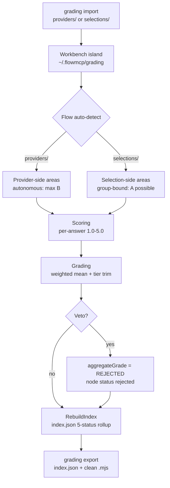

[]() 

# flowmcp-grading

Reference implementation of the FlowMCP Grading-Spec. The active spec is `gradingSpec/1.2.0`
(the v2 break: eleven grading areas, a five-status node model, the workbench island, the derived
`index.json` rollup, and a `/goal`-driven harness). The repository hosts the source modules that
implement Scoring, Grading, Veto, the index rollup, the area prompt builder, and the workbench
IN/OUT round-trip, plus the LLM grader prompts and the unit test suite. The spec lives in
`flowmcp-spec/grading/1.2.0/` and is a **living document** — it evolves with the FlowMCP schema corpus.

## Documentation

This repo documents two structurally different test artifacts:

- **[Code Test Catalog](./docs/test-catalog.md)** — Jest tests that protect the engine
  itself. Runs via `npm test`. Static, manually curated index.
- **[Eval Question Catalog](./docs/question-catalog.md)** — questions that an
  LLM sub-agent answers during a grading. Auto-generated from
  `prompts/generated/questions.json` via `npm run build:question-catalog-doc`.

Both artifacts are complementary: code tests check the engine, eval questions
check the schemas. They are frequently confused — the two catalogs make
the difference explicit.

## Running a Grading

A grading is no longer started by pasting a prompt into an empty LLM context. In v2 the run is
**CLI-driven** via [flowmcp-cli](https://github.com/FlowMCP/flowmcp-cli): the CLI owns the
deterministic stages and drives the non-deterministic stage through the Claude Code harness.

The flow is a four-stage loop. The CLI owns Stages 0, 1, and 3; the harness (your Claude Code
agent loop) owns Stage 2:

| Stage | Owner | What happens |
|-------|-------|--------------|
| 0 — Intake | CLI | `flowmcp grading import <provider-path>` validates the schemas, snapshots them into the island, normalises resources/skills |
| 1 — Deterministic | CLI | `flowmcp grading run <target> --emit-prompts` runs the deterministic pretest (live HTTP checks — the request is never persisted) and the deterministic graders, then emits `prompts.json` + `state.json` for the handoff |
| 2 — Non-deterministic | Harness | The agent loop reads `prompts.json` / `state.json` and grades each area (`start-grade → evaluate → apply-improvement`) — the only stage outside the CLI |
| 3 — Finalize | CLI | `flowmcp grading run <target> --consume-scores <path>` reads the harness scores, computes grades, rebuilds `index.json` (5-status rollup), and finalizes the state for `export` |

```bash
# Stage 0 — import a provider folder into the island
flowmcp grading import providers/defillama

# Stage 1 — deterministic pretest + emit grading prompts (handoff)
flowmcp grading run providers/defillama --emit-prompts

# Stage 2 — the harness grades each area (outside the CLI), writing scores

# Stage 3 — consume the harness scores, rebuild index.json, finalize
flowmcp grading run providers/defillama --consume-scores scores.json

# Inspect the rollup, then export the graded state back to the source
flowmcp grading state providers/defillama
flowmcp grading export providers/defillama
```

The target's path decides the flow, the tier, and the maximum reachable grade:

- `providers/<target>/` → **provider test** — tier `autonomous`, max **grade B**.
- `selections/<target>/` → **selection test** — tier `group-bound`, **grade A** reachable.

### The Entry-Point Prompt and the Goal-Block

The entry-point prompt and the per-area Goal-Block are no longer copied by hand — they are
produced by `PromptBuilder` and emitted into `prompts.json` during Stage 1. The harness drives
each area's prompt against the `/goal` completion condition. Because the small, fast evaluator
model reads **only the transcript** (it calls no tools and cannot inspect disk), the grading loop
**must surface its progress into the transcript** with `[GRADING]` lines:

```text
[GRADING] area=single-test/getFirstPrice schema-valid=ok status=graded written=ok
[GRADING] PROGRESS 7/12
[GRADING] DONE
```

The full definition is in
[Spec §25](https://github.com/FlowMCP/flowmcp-spec/blob/main/grading/1.2.0/25-harness-and-goal.md)
(harness + `/goal` + surfacing convention),
[Spec §20](https://github.com/FlowMCP/flowmcp-spec/blob/main/grading/1.2.0/20-entry-point-prompt.md)
(entry-point prompt + personas obligation), and
[Spec §21](https://github.com/FlowMCP/flowmcp-spec/blob/main/grading/1.2.0/21-pre-conditions.md)
(the "all members stable" pre-condition for selection runs).

### Personas

Persona-bearing areas (skills, About, and the selection-side areas) carry a
`{ basePersonaId, lensId }` pair in the grading envelope. The base personas are `ai-engineer`,
`decision-maker`, `hackathon-builder`, and `schema-maintainer`; the lens selects the perspective.
Deterministic provider-side areas (`single-test`, the tool aggregates, `namespace-description`)
run without a persona.

## The Eleven Grading Areas

v2 replaces the linear phase model with **eleven self-contained areas**. Each area is a grading
rubric attached to the primitive it evaluates and writes to a `_gradings/` folder next to that
primitive. Six are provider-side (`autonomous`, max grade B), five are selection-side
(`group-bound`, grade A reachable).

| # | Area | Side | Evaluates |
|---|------|------|-----------|
| 1 | `single-test` | provider | one tool |
| 2 | `tools-aggregate-schema` | provider | the tools collection of one schema |
| 3 | `tools-aggregate-namespace` | provider | tools across the namespace |
| 4 | `namespace-description` | provider | namespace metadata |
| 5 | `namespace-skills` | provider | one namespace skill (per skill) |
| 6 | `about-namespace` | provider | the About Resource (declared in one schema) |
| 7 | `about-selection` | selection | the selection's About / Domain-Knowledge document |
| 8 | `selection-skills-L1` | selection | one L1 skill (per skill) |
| 9 | `selection-skills-L2` | selection | one L2 skill (per skill) |
| 10 | `selection-skills-L3` | selection | one L3 skill (per skill) |
| 11 | `selection-aggregate` | selection | the selection as a whole (the only path to grade A) |

See [Spec §4](https://github.com/FlowMCP/flowmcp-spec/blob/main/grading/1.2.0/04-phases-single.md)
(provider-side areas),
[Spec §5](https://github.com/FlowMCP/flowmcp-spec/blob/main/grading/1.2.0/05-phases-selection.md)
(selection-side areas), and
[Spec §24](https://github.com/FlowMCP/flowmcp-spec/blob/main/grading/1.2.0/24-selection-aggregate.md)
(the 11th area).

## Status, Tier, and Grade

### Node status (the 5-status enum)

Each graded primitive node (a tool, a schema, an About, a skill, a member) carries one of five
statuses, derived by the index rollup:

| Status | Meaning |
|--------|---------|
| `pending` | Not yet graded |
| `blocked` | Cannot be graded right now, with a `reason` (fewer than 3 working tests, no About, API unreachable) — repairable |
| `graded` | A grade exists |
| `stable` | Fully graded via a `mode: "full"` operation and above threshold — only this status passes the selection pre-condition |
| `rejected` | Veto raised — **terminal and irreversible** |

### Tier and grade thresholds

The aggregate grade is the weighted mean of the per-answer scores on the `1.0`–`5.0` scale
(`gradingSystem/1.0.0`); `n/a` and `stale` answers are excluded from the mean. The banded grade is
then capped at the tier maximum (`autonomous` → `B`, `group-bound` → `A`); the pre-trim band is
preserved as `rawGrade`. A categorical veto overrides the whole computation with `REJECTED`.

| Weighted mean | Grade |
|---------------|-------|
| ≥ 4.5 | A |
| ≥ 3.5 | B |
| ≥ 2.5 | C |
| ≥ 1.5 | D |
| < 1.5 | F |

See [Spec §6](https://github.com/FlowMCP/flowmcp-spec/blob/main/grading/1.2.0/06-determinism-and-tier.md)
(determinism + tier) and
[Spec §7 §4.1](https://github.com/FlowMCP/flowmcp-spec/blob/main/grading/1.2.0/07-scoring-vs-grading.md)
(score-to-grade thresholds).

## The Workbench Island

The grading data directory is a **workbench island**: an internal working area where schemas and
selections are iterated daily, deliberately separate from the shipped repositories. Inside the
island, names are verbose — a logical name plus a timestamp plus a content hash — which buys
predictability, linkability, and version tracking. On the way **out** to the real repositories,
names are stripped to clean spec names.

The island is connected by a two-way, non-destructive **IN/OUT round-trip**:

- **IN — `grading import`** — source → workbench: validate, assert a single namespace, snapshot any
  changed source *alongside* the old one (never overwrite), normalise into the island structure,
  rebuild `index.json`.
- **OUT — `grading export`** — workbench → source: the primary hand-off is `index.json` (the
  complete graded state); clean stripped `.mjs` files may accompany it. The export never overwrites
  the source.

### Island location and the safety line

> **Safety — the module never writes to the real `~/.flowmcp/.env`, and an API request is never
> persisted to disk.** The deterministic pretest performs live HTTP checks but discards the request.
> Grading artifacts (which can carry response data) and snapshots are never committed or pushed.

The island defaults to **`~/.flowmcp/grading`** — global, alongside the single source of truth
`~/.flowmcp/.env` and `~/.flowmcp/config.json`. It lives in the user home by **default**, not in
the repo. The resolution order is explicit (no silent fallback):

1. `--grading-data <path>` flag (resolved against the current directory)
2. `FLOWMCP_GRADING_DATA` env var (resolved against the current directory)
3. `"gradingDataDir"` in `~/.flowmcp/config.json` (resolved against `~/.flowmcp`)
4. default `~/.flowmcp/grading`

If you point an override at an in-repo `grading-data/` directory, that directory stays
`.gitignored` — grading artifacts and snapshots are never pushed regardless of where the island lives.

The full category is defined in
[Spec §22](https://github.com/FlowMCP/flowmcp-spec/blob/main/grading/1.2.0/22-workbench-island.md)
(workbench island) and
[Spec §19](https://github.com/FlowMCP/flowmcp-spec/blob/main/grading/1.2.0/19-folder-layout.md)
(folder layout).

## The `index.json` Rollup

There is exactly **one `index.json` per namespace and one per selection**. It is the derived
rollup — a tree of `tool → schema → namespace` (provider flow) or `member → selection` (selection
flow) — where each node carries its newest grade (resolved via `resolveLatest`) and a rolled-up
status. It replaces the v1 phase-status files and the Kanban contract.

`index.json` has two distinct parts:

- **Live rollup** — recomputed on every rebuild by `RebuildIndex`. It is the **only overwritable
  artifact** in the island; the underlying grading entries and snapshots are never overwritten.
- **Frozen `lockSnapshot`** — written exactly once at grading start and preserved byte-for-byte by
  every later rebuild. It is the point-in-time pin of the member set (`selectionId`,
  `selectionVersion`, `selectionHash`, `generatedAt`, and per member
  `{ schemaId, schemaVersion, schemaHash, gradingStatus, override }`). The selection pre-condition
  gate reads only this frozen snapshot. It folds in the v1 lockfile and the authored
  `namespace.json`, both of which are dropped.

For a selection, the rollup also carries a **member-resolution manifest** — for each member it
records `schemaId → resolved provider artifact + grade + status`, which is what lets the selection
aggregate reproduce its "M of N members PASS" verdict.

See [Spec §23](https://github.com/FlowMCP/flowmcp-spec/blob/main/grading/1.2.0/23-index-json.md).

## Status — v2 break landed

The v2 grading system is implemented and exercised end-to-end:

- **Provider flow proven end-to-end** on the `defillama` namespace — import → deterministic pretest
  → emit prompts → harness areas → consume scores → computed grades → rebuilt `index.json`.
- **Selection flow** runs the real area chain (`about-selection`, `selection-skills-L1/L2/L3`,
  `selection-aggregate`); selection members are auto-chained from the selection definition.
- **`oparl`** is graded as a second provider namespace.

The eleven area output schemas live under `prompts/output-schemas/`; the area prompt builder,
the index rollup, and the IN/OUT round-trip are covered by the unit test suite (`npm test`).

## Architecture

Two area families — one shared data model, two evaluation paths with different tier ceilings — feed
a derived `index.json` rollup.



## Quickstart

Clone the repository and install dependencies:

```bash
git clone https://github.com/FlowMCP/flowmcp-grading.git
cd flowmcp-grading
npm install
```

The recommended way to run a real grading is the CLI stage model above. The module also exposes
convenience functions for programmatic use against the island root:

```javascript
import { gradeSingleSchema } from './src/index.mjs'

const { grading, errors } = gradeSingleSchema( {
    schemaPath: './path/to/schema.mjs',
    schemaId: 'provider.schemaName',
    grader: { kind: 'human', name: 'andreas', version: '1' }
} )

console.log( grading.aggregateGrade, grading.maxAttainableGrade )
```

Results are rolled up into `index.json` under the island (default `~/.flowmcp/grading`) — never pushed.

## Features

- **Eleven grading areas** — six provider-side (`autonomous`, max grade B) plus five selection-side
  (`group-bound`, grade A reachable), each attached to the primitive it grades
- **Five-status node model** — `pending` / `blocked` / `graded` / `stable` / `rejected`, derived by
  the index rollup
- **Derived `index.json` rollup** — one per namespace/selection; a live, reproducible rollup plus a
  frozen `lockSnapshot` and a member-resolution manifest
- **Workbench island + IN/OUT round-trip** — verbose internal naming, stripped on mirror-out;
  `import` and `export` are both non-destructive
- **Versioned namespaces** — `gradingSpec/1.2.0`, `scoringSystem/1.0.0`, `gradingSystem/1.0.0`
  evolve independently
- **Categorical Veto** — closed list of four triggers halts the pipeline; `REJECTED` maps to the
  terminal node status `rejected`
- **Structured error codes** — `GRD-`, `SCO-`, `VET-`, `IDX-`, `IMP-`, `PB-` prefixes per the
  `node-error-codes` pattern

## Table of Contents

- [flowmcp-grading](#flowmcp-grading)
  - [Documentation](#documentation)
  - [Running a Grading](#running-a-grading)
  - [The Eleven Grading Areas](#the-eleven-grading-areas)
  - [Status, Tier, and Grade](#status-tier-and-grade)
  - [The Workbench Island](#the-workbench-island)
  - [The index.json Rollup](#the-indexjson-rollup)
  - [Architecture](#architecture)
  - [Quickstart](#quickstart)
  - [Features](#features)
  - [Methods](#methods)
  - [Repository Layout](#repository-layout)
  - [Versioning](#versioning)
  - [Hierarchy](#hierarchy)
  - [Contributing](#contributing)
  - [License](#license)

## Methods

The public surface is `src/index.mjs` — consumers program against this module only. It exposes
convenience functions plus a set of classes for the underlying primitives. All methods are static
with object parameters and object returns.

### `.gradeSingleSchema()`

Runs the autonomous provider-side path for one schema. Returns a grading entry with `aggregateGrade`
and `maxAttainableGrade` (capped at `B` on the `autonomous` tier).

```
.gradeSingleSchema( { schemaPath, schemaId, grader, options } )
```

| Key | Type | Description | Required |
|-----|------|-------------|----------|
| schemaPath | string | Filesystem path to the schema `.mjs` file | Yes |
| schemaId | string | Stable identifier for the schema (e.g. `provider.schemaName`) | Yes |
| grader | object | Grader identity (`{ kind, name, version, ... }`) | Yes |
| options | object | Optional flags forwarded to the area runners | No |

**Returns**

```
returns { grading, errors }
```

| Key | Type | Description |
|-----|------|-------------|
| grading | object \| null | Grading entry with `aggregateGrade`, `maxAttainableGrade`, `gradings[]` |
| errors | array of strings | Error codes (`GRD-001`, `GRD-002`, `GRD-003`) if validation failed |

### `.gradeSelection()`

Async. Runs the group-bound selection-side area chain for a set of schemas evaluated as a coherent
group. A neutral selection definition is assembled from the inputs (members from `schemaIds`, plus
any `skills` / `personaIds` / `domainDocId` passed through `options`) and the chain runs against the
island root. Grade `A` is reachable (unlike `gradeSingleSchema`).

```
.gradeSelection( { selectionId, schemaIds, grader, options } )
```

| Key | Type | Description | Required |
|-----|------|-------------|----------|
| selectionId | string | Identifier of the selection group | Yes |
| schemaIds | array of strings | Schema ids contained in the selection | Yes |
| grader | object | Grader identity (`{ kind, name, version, ... }`) | Yes |
| options | object | `{ gradingDataRoot, personaIndex, skills, personaIds, domainDocId, selectionJson, ... }` | No |

**Returns**

```
returns { grading, errors }   // Promise
```

| Key | Type | Description |
|-----|------|-------------|
| grading | object \| null | Grading entry with `selectionId`, `schemaIds`, `aggregateGrade`, `maxAttainableGrade`, `phases`, `tier` |
| errors | array of strings | Error codes (`GRD-001`, `GRD-002`, `GRD-004`) if validation failed |

### `.validateGradingEntry()`

Structural validation of a grading entry against the data model defined in
`flowmcp-spec/grading/1.2.0/08-grading-model.md`. Use to verify externally generated grading JSON
before downstream consumption.

```
.validateGradingEntry( { entry } )
```

| Key | Type | Description | Required |
|-----|------|-------------|----------|
| entry | object | The grading entry to validate (must contain `schemaId`, `gradings[]`, `gradingTier`) | Yes |

**Returns**

```
returns { valid, errors }
```

| Key | Type | Description |
|-----|------|-------------|
| valid | boolean | `true` if the entry conforms to the model |
| errors | array of strings | Error codes (`GRD-001`, `GRD-002`, `GRD-003`) if invalid |

### `.getVersion()`

Returns the version triple for the independent system namespaces.

```
.getVersion()
```

No input parameters.

**Returns**

```
returns { scoringSystem, gradingSystem, repoVersion }
```

| Key | Type | Description |
|-----|------|-------------|
| scoringSystem | string | Current `scoringSystem` version (e.g. `1.0.0`) |
| gradingSystem | string | Current `gradingSystem` version (e.g. `1.0.0`) |
| repoVersion | string | Repository version from `package.json` |

### Class Exports

The module exposes the underlying primitives for advanced use. All methods are static with object
parameters. The most relevant for v2:

| Class | Purpose | Error Prefix |
|-------|---------|--------------|
| `Grading` | Grading entry lifecycle, aggregation, tier trim, aging, re-grading | `GRD-` |
| `Scoring` | Per-dimension scoring + weighted-mean aggregation | `SCO-` |
| `Veto` | Categorical-veto application (closed 4-trigger list) | `VET-` |
| `SingleSchemaPhases` / `SelectionPhases` | Provider-side / selection-side area runners | `GRD-`, `SEL-` |
| `RebuildIndex` | Build the derived `index.json` rollup (5-status, lockSnapshot, member resolution) | `IDX-` |
| `PromptBuilder` | Build the entry-point prompt, area prompts, and Goal-Block | `PB-` |
| `GradingImport` / `GradingExport` | The IN/OUT workbench round-trip | `IMP-`, `EXP-` |
| `PreConditionCheck` | The "all members stable" gate (reads `lockSnapshot`) | `PRE-` |
| `HashGenerator` / `SourceSnapshot` | Canonical hashing + neutral source snapshots | `HSH-`, `SNP-` |
| `SharedLists` | Shared-list loader + hash + filename | `SL-` |
| `ErrorCodes` | Error-code lookup, formatting, listing | all prefixes |

See `src/index.mjs` for the full public inventory and `flowmcp-spec/grading/1.2.0/08-grading-model.md`
for the data model.

## Repository Layout

```
flowmcp-grading/
├── README.md                 # This file
├── AGENTS.md                 # Convention for AI tools (island lives in user home, never push artifacts)
├── .gitignore                # Ignores any in-repo grading-data/ override
├── package.json              # ES Modules, Node 22
├── src/
│   ├── index.mjs             # Public API entry point
│   ├── Scoring.mjs           # Scoring System (per-answer scores)
│   ├── Grading.mjs           # Grading System (weighted mean, tier trim, veto)
│   ├── Veto.mjs              # Categorical-Veto logic
│   ├── RebuildIndex.mjs      # index.json rollup builders
│   ├── PromptBuilder.mjs     # entry-point prompt + area prompts + Goal-Block
│   ├── GradingImport.mjs     # IN round-trip (import)
│   ├── GradingExport.mjs     # OUT round-trip (export)
│   ├── ErrorCodes.mjs        # error-code tables
│   └── Phases/
│       ├── SingleSchema.mjs  # provider-side area runners (autonomous)
│       └── Selection.mjs     # selection-side area runners (group-bound)
├── prompts/
│   └── output-schemas/       # the eleven area output schemas + _master.schema.json
├── tests/
│   ├── unit/                 # Jest unit tests
│   ├── integration/
│   └── helpers/              # Shared fixtures
└── (workbench island)        # NOT in the repo by default — lives at ~/.flowmcp/grading
    ├── providers/<namespace>/
    │   ├── index.json                                       ← derived rollup (5-status, lockSnapshot, member resolution)
    │   ├── _gradings/                                       ← tools-aggregate-namespace, namespace-description
    │   └── <schema>/
    │       ├── schema/<schema>--<ts>--<hash8>.mjs           (neutral: no in-source hashes)
    │       ├── _gradings/                                   ← tools-aggregate-schema
    │       ├── resources/about/...                          (about-namespace)
    │       ├── skills/<skill>/...                           (namespace-skills)
    │       └── tools/<tool>/{ tests/, _gradings/ }          (single-test)
    ├── selections/<selection>/
    │   ├── index.json
    │   ├── selection/<sel>--<ts>--<hash8>.json              (neutral definition: members[], skills[], personaIds[])
    │   ├── _gradings/                                       ← selection-aggregate
    │   ├── resources/about/...                              (about-selection)
    │   └── skills/<skill>/...                               (selection-skills-L1/L2/L3)
    └── shared-lists/<listname>/<listname>--<ts>--<hash8>.json
```

Filenames inside the island follow the naming grammar `<name>--<YYYY-MM-DDTHH-MM-SSZ>--<hash8>.<ext>`
(date before hash, so a naive `sort().at(-1)` always yields the newest version); gradings use
`<area>[--<basePersona>--<lens>]--<ts>.json`. Source files carry **no** in-source hashes — all hash
bindings live in the derived `index.json`.

## Versioning

Three independent namespaces; none is coupled to the others — bumping one does not imply bumping the others:

- `gradingSpec/1.2.0` — the active specification documents under `flowmcp-spec/grading/1.2.0/`.
  This is the **v2 break**: the eleven-area model, the five-status node enum, the workbench island,
  and the `index.json` rollup. Earlier `1.0.0` / `1.1.0` gradings are treated as legacy.
- `scoringSystem/1.0.0` — the scoring rules and dimensions (how a test is evidenced).
- `gradingSystem/1.0.0` — the grading rules (thresholds, weights, tier trim, veto list).

## Hierarchy

The [FlowMCP Schemas Specification](https://github.com/FlowMCP/flowmcp-spec) at `spec/v4.1.0/` is the
highest instance — it defines what a schema, a selection, and the primitives are. This Grading-Spec
sits below and describes **how** schemas and selections are evaluated. See
`flowmcp-spec/grading/1.2.0/00-overview.md` for the full hierarchy table.

## Contributing

Contributions are welcome! Please open an issue first to discuss what you would like to change.

## License

[MIT](LICENSE)
